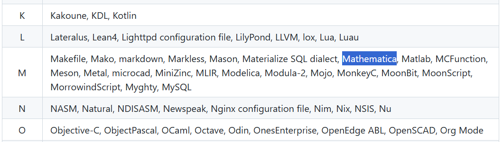

这是一个 <font color=green size=5><strong>功能演示文档</strong></font>, 主要是演示当前网站使用Hextra主题支持的 markdoen 功能


## 基础功能演示

注意，目录只从第二层开始渲染
###### 最多支持到六级标题

引用
> This is a **demo** of the theme's *documentation* layout. <cite>[^1]</cite>


### 数学公式

支持行内数学公式 $ E=mc^2 $ , 行间公式也支持，

$$
\begin{aligned}
    &F=m\frac{\mathrm{d}v}{\mathrm{d}t} \\
    &I=\int_{t_1}^{t2}F\mathrm{d}t \\
\end{aligned}
$$

> [!CAUTION] 警告
> 行间公式不能有空行，也就是禁止下面这样，否则会渲染失败
> 当然，这是一个提示块（高亮块）演示

```Katex
$$

\begin{aligned}
    &F=m\frac{\mathrm{d}v}{\mathrm{d}t} \\
    &I=\int_{t_1}^{t2}F\mathrm{d}t \\
\end{aligned}

$$
```


### 代码块


支持代码块和高亮块


```Python {filename="main.Python"}
import numpy as np
def fun():
    print("你好哇！")
```

> [!warning]
> 但是好可惜，不支持 `Mathematica` 语法高亮
> 但是，按帮助文档的说法，使用的[语法高亮库chroma](https://github.com/alecthomas/chroma#supported-languages)应该是支持才对的啊
> 


```Mathematica {filename="main.Mathematica"}
Plot[ Sin[x], {x,-Pi, Pi} ];
MyFun[] := Module[{},
    Print["欢迎你"]
]
```

### 图片和视频
#### 图片
支持“传统markdown语法 + 描述”


#### 嵌入的b站视频：

<div style="position: relative; padding: 28.1% 45%;">
  <iframe src="//player.bilibili.com/player.html?isOutside=true&aid=228086186&bvid=BV1ch411L7aL&cid=1111035512&p=1&autoplay=0" frameborder="no" scrolling="no" allowfullscreen="true" sandbox="allow-top-navigation allow-same-origin allow-forms allow-scripts" style="position: absolute; width: 100%; height: 100%; left: 0; top: 0;">
  </iframe>
</div>


[^1]: 可以点击跳回去，并且无论这个备注在源代码中放在哪里，都会被渲染到页面的最底下<br> 但是因为导航栏的遮挡，所以等下跳回去之后记得需要稍微往上挪一下页面，这是体验上的小bug