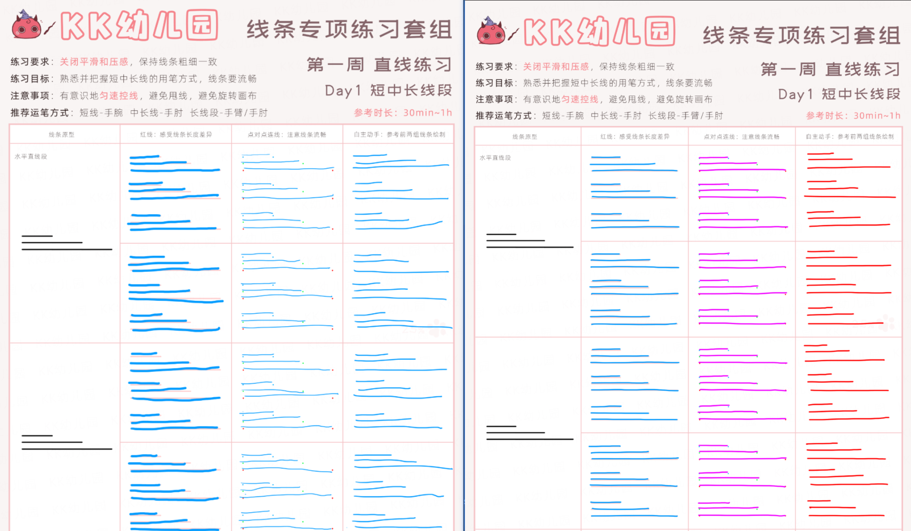
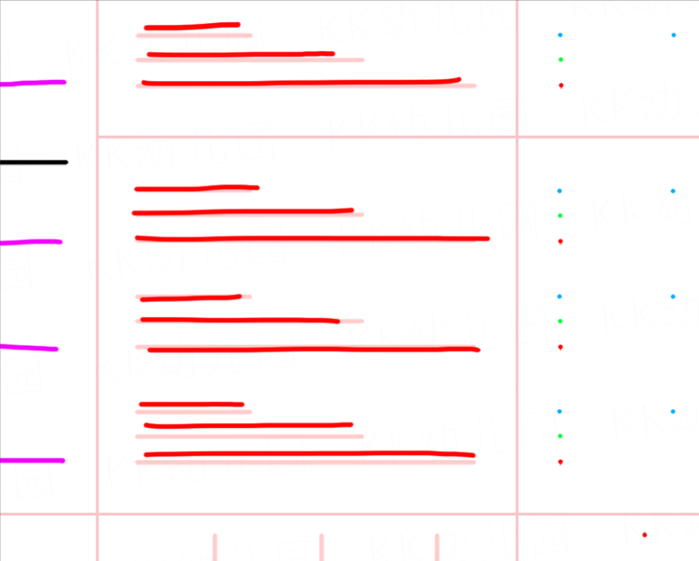

### 2026-07-27
从第一天 2026-07-22 的帕金森，到今天第四天 2026-07-27 能凭空画直线，开心~
为什么会只有4天？因为昨天26号出去聚会了，只练习了第一列带线条的，约等于没练:smirk:

<figure style="
display: grid;
grid-template-rows: auto auto;
gap: 5%; /* 间距 */
width: 100%; /* 整体宽度 */
margin: 0 auto; /* 居中 */
">
<!-- 复制下面的div 块可以插入多行 -->

<!--这里放入图片并排，可以使用输入 imgrow 代码片段快速插入-->

</figure>