+++
title = "从笔记管理到信息管理"
slug = "从笔记管理到信息管理"
date = "2025-09-13T07:08:20.000Z"
lastmod = "2025-09-13T08:14:39.000Z"
draft = false
tags = [ "5-经验技巧" ]
series = [ "精选内容" ]
categories = ["信息管理", "知识管理", "双向链接", "思源笔记", "Obsidian", "笔记" ]
siyuan_id = "20250913150820-ho89zf1"
siyuan_path = "/自-输出-信息管理/从笔记管理到信息管理"
description = "从笔记管理到信息管理的完整历程，探讨了双向链接、卢曼卡片盒笔记法以及知识体系搭建。"
+++

> 本文已发布于微信公众号 **蓝天龙自习室**

‍

# 摘要

这篇推送主要记录我**建立一个可以不断有序扩展的笔记体系**和**笔记管理流程**的完整过程，以及在这个建立过程中所产生的**一些关于“信息管理”、“碎片化学习”等问题的思考。** 

推送总共分为两部分。 **第一部分（正文的第一、二、三大点）是基于信息管理的理念搭建笔记管理的流程。**  前半部分（第一大点）介绍怎么在“卢曼卡片盒笔记法”和“一元笔记法”的基础上，配合“双向链接技术”搭建笔记体系，后半部分（第二、第三大点）则介绍怎么配合这个体系搭建笔记管理流程中其他部分，包括记录、查找调用等。 **第二部分（正文第四大点）是对由笔记管理引发的额外问题的看法记录，主要是关于笔记和信息的使用方式，怎样更好地进行碎片化学习，以及解决问题的工具和方法之间的联系等问题。**  第一个看法是关于怎么样突破传统的单篇文档展示，让所有的笔记以更加合适的方式展示在我们面前，帮助我们高效调用笔记，一个典型的例子是对 Notion 的使用；第二个看法是在平常记录的零碎笔记中看到的，零碎的笔记间的关系无法形成结构体系而想到的碎片化学习的问题——企图单纯通过碎片化的知识构建出某个领域成体系的知识是比较困难的。要解决这个问题，最好的办法就是先花时间掌握需要学习的领域内整体框架的知识（无论是空出大段时间还是利用碎片化的时间），然后再学习碎片化的知识逐渐将细节的知识补充完整，这才是碎片化学习的有效打开方式。第三个看法是在使用几款拥有“双向链”功能笔记产品但得到不同使用体验后产生的——虽然都是“双向链”，但因为设计理念不同，所以导致在使用时可以实现的功能上存在差异，使用方法也不尽相同。选择了一种工具，就是选择了一种解决问题的方法和流程。

# 写在前面

上次整理完自己的素材库之后，突然就想整理自己那些一直散落在各处的笔记。当时的我还不晓得，我将会给自己挖一个多大的坑。因为笔记的整理，远没有素材文件的整理那么简单。

之前整理图片、视频素材的时候，是以实用为主导，在管理时更多的是关注内容（风格）和素材格式上的相似度——就是我能怎么用这个素材，而不是它的内容在逻辑上和别的素材有什么关联。但是对于笔记来说，我更希望可以通过发现不同笔记内容之间的关联，从而发现新的东西。从这个角度来说，我更像是在管理一个灵感库，而不是素材库。正是这种目的上的差别，让我不能直接使用之前的方法来管理笔记。

为了解决这个“内容互相关联”导致不好分类的问题，并建立一个可以长期有效使用、能不断扩展的笔记系统，这段时间一直找资料、思考、尝试，最后总算建立了一个比较符合我需求的笔记体系和笔记管理流程。为了记录这个过程以及总结在这个过程中对一些关键问题的思考，于是写下这篇推送。

# 正文：从笔记管理到信息管理

正文部分我将按照“体系构建 - 记录 - 搜索与回顾”这个顺序来写这一部分，其中一个原因是要更好地展示说明信息流动的过程，另一个则是因为我在一开始考虑怎么管理笔记的时候，首先考虑的就是笔记体系的结构应该怎么搭建。这样做是因为我相信笔记体系是我们要长期面对和使用的对象，记录和调用都只是我们和这个体系进行交互的短暂过程，从这个角度说，好的笔记体系的结构可以让整个管理流程运转起来更加流畅和顺利。

记录的笔记、信息应该要以笔记体系里的信息为参考，让记录的信息更好地进入笔记体系；而让查找、调用笔记这个行为更高效虽然是我们最终的目的，但调用行为本身是需要依托具体的笔记体系来考虑的，也就是说我们考虑调用行为的时候是在考虑通过笔记体系的哪些入口（信息）来查找笔记，所以实际上在确定要怎么使用这个体系的时候就已经同时确定了笔记体系的一部分结构了。因为这些原因，最终我选择了从确定笔记体系结构开始，逐步建立笔记管理的流程。

## 1. 建立有序扩展的信息库

在建立笔记体系之前，首先要确定笔记体系的特点，而这需要我们知道自己想怎么用这个笔记体系。**我建立笔记系统自然是为了更好地管理我的笔记。**

怎么样才叫更好地管理呢？我认为是**随时都可以用尽可能少的时间找到我想要的笔记。** 在这个需求下，“有秩序、有规则”应该是这个笔记体系最基础的特点。因为有规则意味着我们只需要记住少量的关于笔记体系的结构信息，然后就可以按图索骥，找到想要的笔记，使用时间越长，对体系的结构越熟悉，查找的效率也会越高。如果这个体系没有规则，那每一次查找都相当于是第一次查找，之前的查找经验对这一次查找毫无用处。另外，**笔记体系里的笔记数量是会一直增加的**，也就是系统会随着时间一直“扩展”，这是笔记体系一定会有的特点。也就是说“扩展”时还能一直保持“有序”状态的笔记系统，才能让我可以随时都能用尽可能少的时间找到我想要的笔记。后面所有的分析和工作，都是围绕“让笔记系统一直处在‘有序扩展’的状态”这个目标展开的。

### **1.1 背景和基础：从文件夹、标签到双向链**

在最开始接触到大量文件的时候，大家都会下意识地根据文件之间的相关性将他们放在一些文件夹下，最终让这些文件都进入到“树状的文件夹结构中”。但是文件之间的关系并不是只有父子关系，所以一般来说只用文件夹管理文件这样的管理方式是不完善的，之前的“素材管理”系列的推送也提到并尝试解决这个问题。对笔记而言自然也存在这样的问题。在传统的树状文件夹体系下，总是不知道该把这些笔记放在什么文件夹下。例如，这篇推送是我的笔记之一，但同时也是我的公众号推送文章之一，如果按照传统的文件夹分类，该把这篇文章放在哪里确实是个很难解决的问题。复制一份当然是一种解决办法，但同时维护两份文份实在比较浪费精力，而且也是“治标不治本”——关联数量较多的时候修改就很麻烦了。

而且，在用文件夹管理笔记时还会遇到另一个内容关联的问题，一篇笔记的内容可能包含好几个话题，例如这篇推送，同时包含了信息管理，笔记管理，碎片化学习等好几部分内容，我要怎么做才可以让这篇笔记和其他相关的笔记产生联系，在所有笔记里查找这里其中一个话题的内容时也能找到这篇推送。

后来，有了印象笔记这样的工具，可以给笔记打标签了，甚至允许将文件夹系统的一部分逻辑结构转移到标签系统中，这确实解决了一篇笔记同时“属于不同类别”和“包含多个话题”的问题，但也会让另一个问题更加明显：贴一些比较粗略的，通用性很强的标签可能会忽略掉笔记的”个性“，不方便我们后面根据标签查找调用笔记；贴一些比较”细“的、准确的标签又会导致标签数量急剧增加——可能时间一长自己都忘了打过什么标签，最后整个标签体系越来越臃肿和混乱，难以管理，从而让标签系统失去存在的意义——让我们可以更方便看到整个笔记体系的结构，然后更高效地查找调用笔记。

如果说平时花精力去同时维护标签系统和文件夹系统，不断地增加、删除、修改一些标签，及时转移相关笔记，当然可以让这个问题没那么严重，但实在是有点累人，而且，心理学家戴维·迈尔斯在《社会心理学》这本书中提出过一个观点：  **“知识本是一体的。把它分成不同的学科只是屈从了人类的软弱。”**  从这个角度来看，每个标签其实都可以看作是一个知识点。在这种视角下，标签之间的关系是错综复杂的，管理标签相当于直面这种错综复杂的关系。维护标签比维护树状文件夹这种逻辑性强的结构可难多了。由此可见，建立一个合适的标签体系，是很有必要的。

‍

> #### 【💡 举个例子】
>
> 假如有一篇介绍怎么利用“二八法则”给画面进行配色的文章，我们可能会不假思索地给它打上“配色”、“二八法则”这样的标签，“配色”这个标签可能还好管理，比较容易想到可以归类到“艺术”、“设计”之类的标签下，但这个“二八法则”的标签就不太好分类了。事实上，“二八法则”和时间管理、投资理财等领域都有联系，是个综合性比较强的标签，这时我们该怎么管理这个标签呢？

‍

管理知识之间这种错综复杂的关系是我在整理笔记过程中遇到的最大的问题，也是“双向链接笔记”（以下简称“双链笔记”）这个概念在提出的时候想要解决的一个核心问题[[1]](#20250913154101-dbw79dr)。

所谓双链笔记，就是拥有“双向链接”（以下简称“双向链”）特性的笔记。而“双向链接”，是区别于“单向链接”而言的一种链接状态。在互联网上搜索得到的结果，就可以看做是一条条指向目标的单向链接。一般来说，一旦点击某一条链接进入到具体的页面之后，我们是没有办法看到从哪个网页进来的。而“双向链”技术则给我们提供了这样一种可能：点进一个页面之后，我们可以在这个页面里直接看到有哪些页面是指向（引用）我们当前所在的这个页面，包括我们刚才进来前所在的页面。

> #### 【💡 举个例子】
>
> 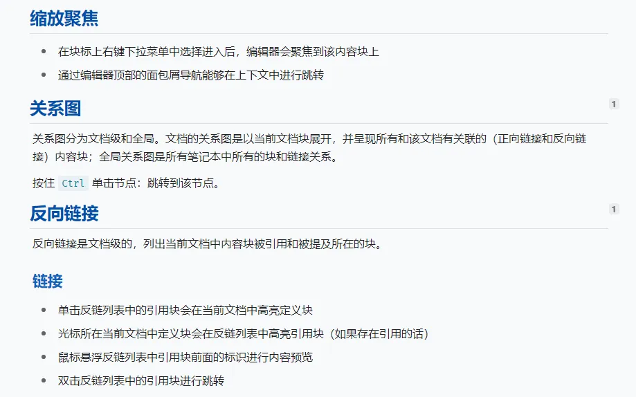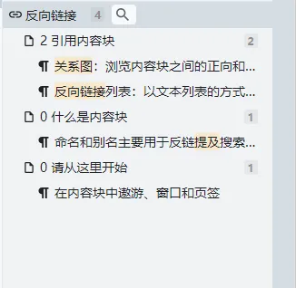
>
> 上图是思源笔记帮助文档中的部分内容，下图是思源笔记查看反向链接的面板，其中高亮的部分是上图中被其他页面引用的内容（二级标题），可以看到在被引用的内容右边有显示被引用的次数。

‍

换句话说，“双向链”技术可以将指向当前页面的所有链接汇总到当前页面中并显示出来。有了“双向链”的技术，我们就不仅可以在当前的笔记引用别的笔记，也能看到这篇笔记被哪些笔记引用，“双向链”可以说是升级版的标签。这对于解决上面提到的“知识一体”带来的问题是相当有用的。

‍

### **1.2 工具和方法：双链笔记与卢曼卡片盒笔记法**

“双向链”的概念和技术，笔记圈中很早就有软件引入了。例如 Trilium、MyBase，都拥有双向链功能。但这两个在国内都属于小众软件，在国内的笔记圈中一直都没有推广（搜一下相关 QQ 群，从群数量和群人数就能看出来）。

直到 2020 年底 2021 年初，国外一款名为“RoamResearch”（以下简称“RR”）的有双向链功能的笔记软件（简称“双链笔记”）将“双向链接”的概念在笔记圈推广开来，才引发了笔记圈的“双向链”的热潮，然后国内外越来越多双链笔记被开发出来。除了 RR，还有国外的 **Obsidian**、**Remnote**、**Logseq**，国内的 **RoamEdit**、**葫芦笔记**、**思源笔记**、**我来 wolai** 等等，也有越来越多的工具加入了“双向链”的特性，例如**飞书文档**、**幕布**，作为老牌笔记工具的**印象笔记**，前不久也终于增加了“双向链”的特性。

#### **1.2.1 卢曼卡片盒笔记法**

“双向链”概念一经 RR 推广，“双链笔记”这个工具在笔记圈马上变得火爆[[2]](#20250913154101-ksnxc7b) 。网上也多了很多关于双链笔记软件的推广文章。有意思的是，很多推文里都有提到了用双链笔记软件做笔记的方法。其中一个被提到最多的就是“卢曼卡片盒笔记法”（以下简称“卡片盒笔记法”）。RR 的开发者从似乎从这个卡片盒笔记法里找到了一些功能开发的灵感[[1]](#20250913154101-dbw79dr) 。

根据《How to Take Smart Notes》这本书里的描述，卢曼的这一套卡片盒笔记法更加接近于一套完整的信息管理流程[[3]](#20250913154101-eh27nl6)。关于输入输出的“费曼学习法”，关于笔记体系架构的“一元笔记法”，都可以在卢曼的卡片盒笔记法中找到影子[[4]](#20250913154101-jpbt6ck) 。

‍

> #### 【📌 补充资料：卢曼卡片盒笔记法】
>
> 这是德国社会学家尼古拉斯·卢曼所使用的一种笔记方法，因为卢曼生前就产出了大量的工作，甚至在他死后大家根据他的手稿整理出不少可以发表的完整内容。这让大家相当震惊，后来大家发现他在使用这样一套不太常见的卡片盒笔记法，于是开始研究他的这套方法，后来还专门为介绍他的这套方法写了一本书，叫《How to Take Smart Notes》[[5]](#20250913154101-j76xg5v) [[6]](#20250913154101-q9p5c5w)。
>
> 简单来说，现在大家谈论得比较多的卡片盒笔记法就是将平常产生的想法、看到听到的一些信息记录在一张小卡片上，接着找个时间对这些卡片的内容作进一步的整理，写入一张新的卡片，原先的卡片丢掉，然后根据已经事先建立好的标签系统，给新卡片添加一个标准的、独一无二的编号，最后将新卡片放入一个盒子中。需要调用的时候，就根据相关标签的编号在盒子中找到自己想要的卡片。
>
> 但严格来说，卢曼有两个卡片盒，上面提到的那个只是他的其中一个卡片盒，用来存放灵感和比较碎片化一点的信息，而他另一个卡片盒里的卡片则是写着和他研究相关的书籍资料的信息，包括了这份资料所引用的文献以及这份资料的摘要[4]。这个卡片盒可以理解为我们传统的笔记管理形式。

‍

> #### 【📌 补充资料：费曼学习法】
>
> 指物理学家理查德·费曼所提出的一种学习方法。简单来说，就是当你想掌握某个知识的时候，可以在尽可能不使用原文的情况下，将这个知识讲给一个对相关知识不熟悉的人，甚至是一个 8 岁的小孩子听，并尝试让他明白。如果能做到，那就说明对你已经这个知识理解得比较透彻了[[7]](#20250913154101-k6lqh71)。

‍

> #### 【📌 补充资料：一元笔记法】
>
> 这是日本新闻工作者奥野宣之在《如何有效整理信息》一书中提出的一种笔记体系 [[8]](#20250913154101-2ugxgec) 。这个方法的核心内容是，对收集到的信息不加以分类地按时间顺序放入同一个地方，并和提前建立好的索引体系建立关联。用原文的观点就是对笔记进行“一元化”、“时序化“、”索引化“管理[[9]](#20250913154101-d7rho9v) 。

‍

从《How to Take Smart Notes》中对这个“卡片盒法”的描述来看，我没有找到卢曼建立卡片的编号的依据，不过《如何有效整理信息》给出了另一个解决方案——给笔记贴上时间标签，这确实是个很不错的想法。笔记产生的时间是独一无二的，也是可以人为地控制格式和方便查找的。RR 以及后来的类似 RR 的产品都将“DailyNotes”——也就是每日笔记这个功能放在主菜单这种显眼的位置，或许就是从这里受到启发。

对比“卡片盒笔记法”和“一元化笔记法”，可以发现两种方法所提倡的笔记架构都是差不多的：不分类，但是使用额外的、已经建立好的索引体系建立笔记之间的联系。换句话说，就是将具体的笔记本身的管理，完全转移到了一个个抽象的标签之中，通过管理标签体系，来间接管理信息库的结构。  **“笔记在哪里并不重要，重要的是它的内容，它的关键词，是否可以成为别的笔记的基础 ”**   [[10]](#20250913154101-et1mbk7) 。

‍

#### **1.2.2 建立标签系统**

虽然《如何有效整理信息》里给出的“用时间标签作为索引”是个不错的方案，但对于一篇笔记来说，只有时间标签的话，在查找时是不足以被很快定位到的——毕竟时间一长就很难记清楚是什么时候写的这篇笔记，因此我们还需要加入其他的标签来建立一个标签系统，也就是说，刚引入标签系统时就带来的问题现在还是没有解决。

‍

> #### 【💡 中场休息】
>
> 先来捋一下整件事情的发展过程。
>
> 为了可以建立起不同文件夹中笔记的关联，大家引入了标签系统，但因为可能存在“随着时间推移而标签数量爆炸”的问题，所以还需要去寻找更好的解决办法，直到双向链概念被引入，给“标签数量爆炸”的问题提供了技术上的解决方案——可以不区分标签和笔记（知识），标签就是知识，知识就是标签。紧接又着翻出了前人的笔记方法，最终还是选择将标签和笔记分开。
>
> “标签数量爆炸”的问题可以说已经被解决了，但因为我们现在是完全通过管理标签来管理所有笔记（以下称为“笔记库”），标签系统的特征就成了笔记系统的核心特征，所以现在问题的重点变成了，什么样的标签系统才是一个合适的笔记库索引系统，并且同时还能满足笔记体系“有序扩展”的需求？

‍

> #### 【💡 举个例子】
>
> 在某篇收藏的文章中提到，“可以用肥皂水（洗衣粉）+ 糖消灭家里的蟑螂” [11] ，第一反应会打什么标签呢？生活？小技巧（小妙招）？蟑螂？肥皂（洗衣粉）？看上去都可以，但怎么样把这些标签组成一个可以有效扩展的标签体系呢？

‍

从上面这个例子来看，我们贴标签的时候会习惯“粗细结合”——贴一个粗略的标签，例如“生活”，再加一个细致点的标签，例如“灭蟑螂”，我们不妨继续使用这种形式的标签结构对笔记、资料进行定位。但是这样子贴的标签似乎对具体笔记内容的依赖性很高，不好归纳出什么规律，当然就不适合作为通用的索引进入索引系统，也很难实现标签系统“有序扩展”的需求。

重新考虑我们想要的标签系统需要什么功能特征，第一个，最好可以无所不包，不管什么笔记（知识）都能容纳包含进去；第二个是有规律，规律意味着规则、逻辑，就是看着有树状结构。仔细想想，这就是图书馆对书籍的管理体系啊。不管我们需要什么样的资料，总可以通过图书馆的查询系统查到相关的资料在哪一层楼哪个书架的哪一层，这个规则可以说足够清晰了。再深入一点点，这就是整个**人类知识库的结构**啊。

“知识一体”的问题是存在的，虽然现在还没有一套公认普遍适用的知识分类方法，但是并不阻止我们用现成的分类方法搭建索引体系。为了克服这个问题大家也做了很多工作 [12] 。而图书馆的管理系统就是一个很好的索引系统，所以这里就直接“抄作业”了 [13] 。不过，国内外图书馆的分类法还是有点区别的，例如国外使用的是“杜威十进制图书分类法”，国内使用的则是“中国图书馆分类法”（简称“中图法”）。至于使用哪个就看个人喜欢了——现在我在使用的是中图法。

当然，上面说了这么多，都仅仅是针对日常的碎片信息进行整理并建立标签体系的过程。如果是那种有明确目标的项目，建议还是用 P.A.R.A.的方法建立信息库会更加实用一点，而且标签的结构也不一定要“粗细结合”。具体选用什么样的标签体系，贴什么标签还需要根据项目的具体使用情况决定。

‍

> #### 【💡 举个例子】
>
> 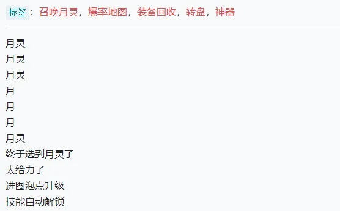
>
> 是我其中一份工作相关资料的部分信息，前三个标签就是这个项目里通用的索引标签，后面两个则是这份资料的特征标签。虽然标签体系的具体内容不一样，但是结构还是一样的。

‍

> #### 【📌 补充资料：P.A.R.A.方法】
>
> 这是一种基于“信息的时效性程度”来分类的方法。具体是指：“（当前具体的）项目 Project、（项目所涉及的）领域 Area、（项目需要的）资源 Resource、（已经完成，暂时用不上的）归档资料”Archive，是一种比较简单，轻量的信息管理系统 [14][15] 。

‍

#### **1.2.3 笔记系统的优化：规范笔记格式**

在这种“一元化”的笔记体系基础上，我对自己的笔记体系做了一点改动，其中一个是格式规范化，另一个是标签系统的精简化。

对于第一个改动，是希望可以像真正地管理数据库一样管理笔记 [16][17] 。

> #### 【💡 举个例子】
>
> 后期笔记数量很多的时候，怎么样可以快速查找到自己想要的相关笔记是以一个逃不过的问题。而让笔记拥有统一的格式，是帮助我们快速查找笔记的一个重要基础。
>
> 这个特征的想法来源是大学时班委在收集资料的做法。她一直强调我们要把给信息按一定的格式发给她，这是有原因的。在表格的视图下，格式统一的信息都会按照一定的规律进行排序，我们在查找的时候根本不用费精力去关注每一条信息的内容，只需要在信息滚动的时候停一下瞟一眼，就大概能知道离我们需要找的内容大概还有“多远”，然后继续滚动信息直至找到目标信息。
>
> 而且格式统一的信息在搜索时更加容易确定搜索关键词的形式。例如，我要搜索时间的信息，如果大家都不统一时间的格式，有人写 2021-06-26，有人写 2021/06/26，有人写 20210626……这样一来，管理信息的人将会增加大量不必要的工作。如果每一条信息都有相同的格式，我们甚至可以用很简单的程序语句来帮助我们减少更多没有必要的工作量，把精力放在更重要的工作上。

‍

笔记（信息）的格式其实没有什么特别的讲究，不同的人有不同的理解和做法。我设想中的笔记结构很简单，就是普通的“标题 + 标签 + 内容”。每一部分的作用分工是很明确的：标题存放的是整篇内容的高度概括，方便我可以在不点开全文的情况下帮助我想起这篇笔记是什么内容；标签存放的这篇笔记的定位信息（关键词），方便和整个笔记库进行关联以及后期查找，内容自然就是存放具体的笔记内容了。标题和内容这里暂时先放一边不讨论，因为涉及到和整个笔记库的交互，所以标签怎么贴相对来说更重要一些。这就是第二个改动的地方要说的。

‍

#### **1.2.4 标签系统的优化：精简标签系统**

第二个改动是精简标签系统。这么做是为了降低维护标签系统的难度，这个精简方案是基于双向链技术实现的。

按照前面提到的两种笔记方法，标签体系是提前建立好的，而不是遇到什么笔记、内容再创建一个标签。那我们也要建立像图书馆查询系统那样庞大的标签系统吗？当然是不可能的。因为人的精力一般是有限的，感兴趣的领域和有深入研究的领域不会太多，所以需要对这个标签系统做一些简化处理。怎么简化呢？中图法确实有一个简化的表——只提取最前面两个级别的目录，不过这次没有抄他的作业，一方面我觉得这个方案不太合适——对于一些比较深入的内容，只有两级是肯定不够的。另一方面是因为我在计算机的动画模型制作技术中找到了另一种简化的技术——LOD（Levels of Detail）技术。用这种技术理念对标签系统进行进行简化，不仅可以大大减少标签的数量，同时也能最大限度地保留目前对我们来说有价值的标签。

‍

> #### 【📌 补充资料：LOD（Level of Detail）技术】
>
> LOD 技术是在虚拟的现实场景中有效的图形生成加速方法。简单来说，就是在电脑中生成一个物体时，根据摄像机和被拍摄物体的距离，来决定被拍摄物体需要呈现（生成）多少细节。
>
> 因为电脑中生成的物体一般都是由一个一个的三角形平面或四边形平面拼出来的（一般用四边面），物体细节越多，需要的平面数量也越多，计算量也越大。但是计算机的计算能力是有限的，不可能所有物品都使用丰富的细节（直观的影响就是，当场景里有很多细节丰富的物体时，这个场景的动画预览播放时会很卡顿），而且也没有必要（太远的物体人眼是看不清其中的细节的）。所以，需要通过这种“巧妙”的方法重新分配计算机的工作量，让计算机在计算能力有限的情况下可以呈现更好的效果。 [18] 。
>
> 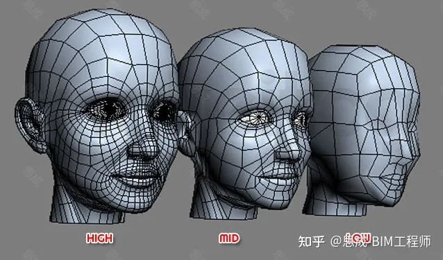

‍

具体怎么使用 LOD 技术来简化标签系统呢？就是熟悉的，深入的领域，在合适的时候可以使用更深层的分类，刚接触的、不熟悉的领域，就用浅层的分类。举个例子，我对物理方面的知识结构了解多一点，基本可以写出整个物理领域知识的大框架，对一些问题有自己基本的判断——例如对一些光学问题知道是属于衍射问题还是干涉问题，就可以加上更细、更深层的的标签；对设计了解不多，只知道平面构成相关的配色、构图，以及动画规律这些零碎的知识点，我就可以在索引系统只保留“设计”这一个大的标签。直到我将对整个设计领域的知识框架有了更多的认识，我可以再对笔记的标签进行更换或者增加更深层的标签。

‍

#### **1.2.5 笔记内容的迭代**

在少量通用的索引标签的基础上，再加上这篇笔记的特征标签（其他笔记）和时间标签（一元笔记法中建议将笔记“时序化”），一篇笔记就算是规范好形式，可以进入笔记库了。

> #### 【💡 举个例子】
>
> 例如那个配色和二八法则的例子，我在这个系统下依然给这篇笔记贴上“配色”、“二八法则”这两个标签，但是这两个标签并不是来自标签（索引）系统，而是两篇独立的笔记，另外还会贴一个名为“设计”的通用标签。换句话说，一篇笔记通过双向链变成了一篇笔记的标签，这让笔记之间直接产生关联，而不需要靠额外的标签（索引）。
>
> 而基于中图法所建立的少量通用的标签（笔记），基本上只是起到提纲挈领，帮我们总览笔记（信息库）的结构的作用。具体的做法是将所有的通用索引标签链接到一个文档页面之中，对标签进行统一管理，这样不仅可以看到标签系统的结构，而且和分类法的结构对比，就可以看到哪一块知识是欠缺的。如果有需要就可以及时补上。
>
> 我可以在这些标签里写下自己对这个标签的理解，让它也成为一篇“笔记”，也可以选择空着不填任何内容。一般我都会偷懒，直接到百度百科上先复制基本的概述，后面有时间再补充自己的看法（很可能就没有时间了 😂）。因为看着白花花的页面有点难受。而且，百科上的信息基本概括了这个领域的主要定义和内容，了解这些可以加深自己对这个标签（领域）的理解。

‍

因为笔记里可能会有我们对某件事或某个现象的看法（观点的输出），而我们对同一件事的看法可能会因为着我们经历了越来越多的事情而发生改变，所以不可避免地会对原来的笔记进行修改迭代。在迭代中起主要作用的是时间标签，也就是这篇笔记是什么时候进入信息库的（或者说什么时候被记录下来的）。在迭代的时候，不需要对原来的内容进行修改，而是在下面继续补充内容，同时贴上迭代时的时间就可以了

‍

‍

> #### 【💡 举个例子】
>
> 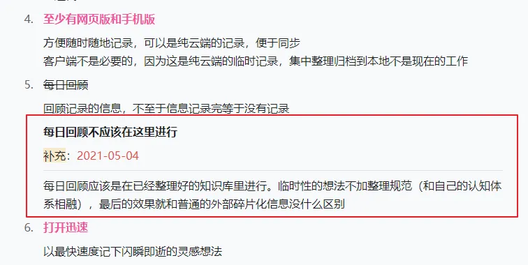
>
> 这是这篇推送处于草稿阶段时的话题迭代部分，虽然这一部分的观点已经被抛弃，没有出现在正文之中，但是这些保留在草稿中的信息可以帮我更完整地回顾自己是怎么一步一步得到现在的结果的。以及知道自己有没有忘记考虑哪一方面的内容。另外可以看到，迭代的部分也是采用了和笔记开始时相似的格式。
>
> 如果话题迭代、讨论的次数频繁，可以使用大纲类工具来追踪讨论的过程，就像下面的图片展示那样：
>
> 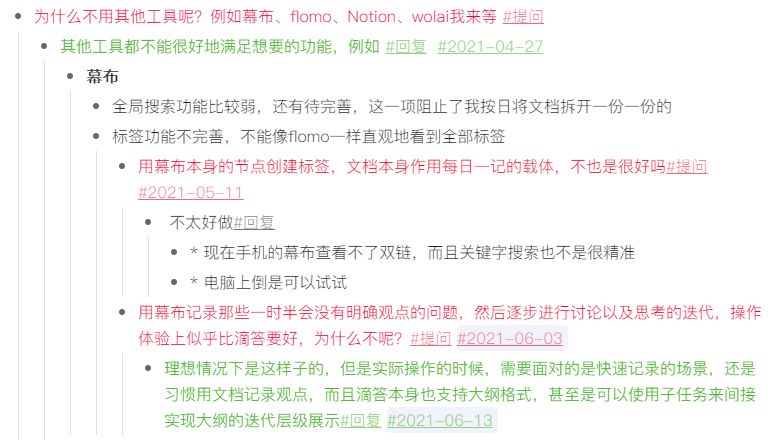
>
> 这是在幕布上的迭代过程展示，在笔记库中也可以用类似的方法对笔记进行迭代。

‍

### **1.3 总结**

到这里，整个笔记库的结构和使用方式已经清楚了。总结一下就是三点：

1. **一元化**——所有笔记（信息）都放到同一个地方并且不要分类
2. **格式规范化** ——所有笔记（信息）都被统一的格式包裹起来，例如我的笔记都统一是按“标题 + 标签 + 具体内容”来写的
3. **建立合适的标签系统**——通用（繁杂）的笔记，就在“图书馆分类法”这种通用知识库的分类方法上进行适当的简化，尽可能精简实用。

因为所有的笔记都有相同的结构（标题 + 规范化的标签 + 内容），整个信息库的信息就是一个有序的紧密的整体，你甚至可以将这个笔记系统完美地转到 Excel 表格里面，像真正使用一个信息库那样进行使用。而不是像一开始引入标签系统那样，表面上每篇笔记都各有所属，笔记库井井有条，但实际扒开来看依然混乱不堪，需要查找的时候不知道从哪里开始找起。

## **2. 更好地记录收集信息**

经过上面又臭又长的讨论，最后终于确定了笔记库的样子。前面说过，确定笔记体系只是笔记管理流程的一部分，接下来我们就要开始讨论怎么记录、查找调用笔记了。因为从这里开始要涉及到笔记内容在不同流程中的转移，所以需要将笔记抽象为一种信息来考虑，因此下面的第二大节和第三大节将不区分“笔记”和“信息”这两个词的含义。

### 2.1 记录

我们在建立笔记体系的时候顺便确定了笔记的形式，不过，我们在做记录、写笔记的时候也要按照这种形式写吗？其实不需要，因为记录笔记和让笔记进入笔记库的目的不同，要求当然也不同。 **记录的目的只有一个，快速地将当前我们觉得有价值的信息记录下来。**  这里包含了两个关键的特征：快速、信息记录。

后面的特征意图是很明显的，这是信息流的源头，只有在输出成实实在在的文字的时候，脑海里那些天马行空的、跳跃的、模糊的想法才会逐渐变得清晰；快速记录，是因为信息可能一闪而过，特别是灵光一闪的想法，也许下一秒就不记得刚才自己具体是怎么想的，想表达什么了。这个是记录笔记和让笔记进入笔记库两个流程最主要的区别。

基于上面两个特征以及和笔记体系对接的需求，我希望这个工具有以下的功能特性：

1. **时间轴（例如日历之类的功能）**   
   这是用来自动记录笔记产生的时间，为后面笔记进入笔记库贴上时间标签做准备
2. **层级标签系统**  
   这是为了方便在没有录入整理的时候也能大致查看笔记类别和结构。这个标签也和信息库中的标签不太一样，在记录的时候，可以随心所欲地给笔记打标签，合适就行，因为这个标签只是方便我们短期内查找记录里相关的信息并汇总，然后整理放入笔记库，整理完成后这些标签大可以全部删掉。
3. **软件打开迅速**  
   如果打开软件都要 7、8 秒，我可能早就记不起刚才想的内容了，可不能因为工具的原因影响我们记录转瞬即逝的灵感。
4. **支持多种格式**  
   **支持多种格式**  
   信息的形式有很多种，除了最普通的文字，还有图片、超链接等等，只支持文字记录的记录工具在这个多媒体信息时代已经跟满足不了我的需求了。

以上是最基础的功能需求，但为了可以有更好的记录体验，我额外希望增加是两个交互层面的特性：

5. **至少有网页版和手机版**  
   有这个需求是因为想要随时随地都可以方便记录。毕竟电脑端的操作习惯和手机端的操作习惯还是有很大差别的。而电脑客户端有点过于笨重了。反正都是要联网同步的，相比之下网页即开即用更加便捷，记录一清网页一关信息安全一步到位。
6. **最好支持大纲模式编辑、Markdown 模式编辑**  
   大纲编辑模式可以帮我们快速缕清记录信息的逻辑关系，同时借助时间标签，在短期内对同一个想法进行迭代（就像上面举的幕布的例子）；而想要 markdown 编辑主要是个人习惯，在 markdown 中使用一些简单符号就可以实现如 **加粗** 、引用、下划线 ,`代码块` 等很多格式。

这里推荐一个我在用的记录工具：**滴答清单**。主要原因当然是他满足上面所有的需求啦！

- 将随手记录放入任务提醒，不容易忘记
- 自带日历（时间轴）
- 任务模式下可以添加多层子任务，也可以选笔记模式
- 支持父子级标签
- 网页、手机、电脑端都有，打开速度相当快(几乎即点即开)

虽然有会员，但是白嫖的功能也已经足够用了。至于容量的限制算是强迫自己赶紧将琐碎的记录整理归档，或者是“断舍离”删掉。

‍

### 2.2 收集

记录的信息通常都不太长，也比较零碎，整体来看每一篇信息之间目的性、关联性都不强。而收集资料时通常都有一个明确的目的，也基本不会马上就输出观点。这些收集到的资料通常都是作为参考来用，因此相对记录来说要做的事情简单很多，不需要像记录一样添加那么多信息，**而只要按照收集的目的对这些资料用传统的文件夹形式做好相应的分类**就可以。

目前我在使用的方案是  **“语雀 + 有道云”。**  语雀是阿里的产品，他们自己公司内部也在用。他们给语雀的定位是“专业的云端知识库”，体验过后个人觉得，语雀的结构也确实拿来很适合做资料的收集、整理工作（网上有评价说语雀不像是笔记，更像是个人博客，用来沉淀知识）。

而有道云只是作为一个辅助工具。因为语雀在手机上没有相应的剪藏功能，所以只能暂时用有道云代替。虽然印象笔记也有剪藏的功能，但不知道为什么在安卓手机上一直都剪藏失败，只能无奈放弃。

> #### 【💡 举个例子】
>
> 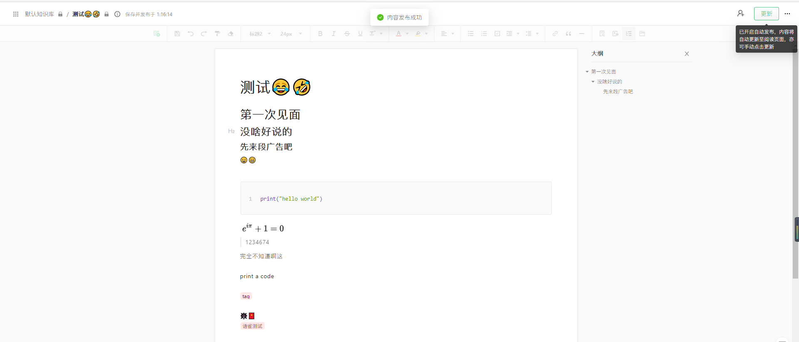
>
> 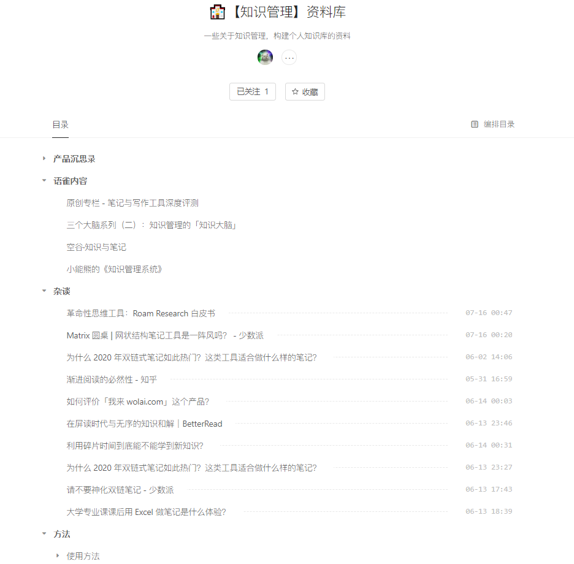

‍

## 3. 更好地使用笔记库

### 3.1 查找

无论是笔记还是信息，只有当它们被用起来的时候才是有用的。前面做的所有工作，都是为了可以更好地用上这些笔记。无论是双向链、标签还是文件夹，想要达到的目的都是一样的，就是用尽可能少的时间找到想要的信息。

在记得其他相关的准确信息的时候，直接搜索当然是效率最高的查找方式。不过大多数时候我们记得的东西并不会太准确。我们的大脑似乎更加擅长根据已有的线索去思考和联想。在笔记管理里这些已有的线索更多是指“标签”这样的关键词。

普通的标签系统可以做到这种线索的作用，但是这种线索是只是一次性的，我们只能一个一个地点开标签来查找，直到找到目标信息。加上了双向链之后，情况变好了一些。它提供了一种新的方向，因为利用双向链的反向链接功能，可以看到哪些笔记是和当前笔记有关联的，也就是说，我在检索标签的同时，也可能从当前检索出来的笔记获得寻找线索的灵感，我在标签里检索的同时也在通过其他笔记在整个信息库里检索。这种“片状检索”当然比单个标签的“点状检索”要高效一点点。

所以我有理由相信，前面新构建的双链笔记库，在查找想要的笔记时可以比传统的文件夹更加方便，效率也可以更高，因为现在我们有不止一条路可以到达“目的地”。而且每一篇笔记都有贴上被“规范”过的标签（索引），我们可以找到很多条“通往目的地的路”，其中当然也包括传统文件夹那种“树状结构”的路。另外，在发现一条路行不通的时候，我们可以随时跳到另一条路的任意位置（任意想到的标签）上继续走下去——因为整个关系网可以说是平铺在我们面前的，而不是像 windows 系统的文件夹套娃结构那样要退出来然后再一层层地进去——那种感觉真的像是在翻箱倒柜。这就是使用双向链查找笔记的优势 [20] 。

另外，因为反向链接功能是“自带汇总”属性的，也就是说，和这篇笔记相关的笔记都会被汇总到当前页面下。可以设想一下，如果包括观念输出之类在内的笔记都和 DailyNote 这样带有时间属性的笔记链接到一起，那这个体系就相当于成为了记录我们人生成长的”一本书“，我们可以随时翻阅我们是怎么一步步成为现在的样子的人，这种感觉应该也是很奇妙的吧！

### 3.2 回顾

这一部分其实已经没什么好说的了。信息回顾得可能比较少，笔记应该会回顾得多一点。“温故而知新”大家都懂，这里只是提供一种相对更舒服的方式回顾已经记录的笔记——随机复习。毕竟在笔记数量比较多，时间过了比较久的时候，可能会忘掉之前都有过一些什么奇奇怪怪的想法被记录下来了。

现在很多笔记工具都有这种“随机复习”的功能，例如 Obsidian 的随机复习、我来 wolai 的手气不错、flomo 的随机漫步、RoamEdit 的随机复习、思源笔记用简单的 SQL 语句实现的随机抽取……这种随机抽取有点像是探险的感觉，如果对自己的笔记库内容不熟系的话，还有点像是在刷知乎，特别是很久之前的一篇笔记被推到面前，那种感觉真的很奇妙：“原来我之前还有过这种想法……”（个人感觉如此）。甚至可能的话，还会和当前的想法产生碰撞，然后有了更好玩的想法也说不定呢\~

‍

## 4. 额外问题

这一节主要是记录在建立笔记体系和笔记管理流程时产生的一些问题，以及现在对这些问题的看法，包括怎么样让笔记库变得更好用，怎样更好地进行碎片化学习，怎样理解解决问题的工具和方法之间的关系。

### 4.1 树状结构还是网状结构？规则与自由的矛盾

这是一开始就觉得很困惑的问题。

“网状结构”是双向链笔记刚被引入笔记圈的时候，很多人写推文时都喜欢用的一个词。它和传统的文件夹树状结构相对应，是指笔记之间的关系有着像“网”一样的结构，这个词一般和双向链关系图（下面 4.2 小节会做详细点的说明）搭配使用。

类似 RR 的软件界面上的功能都只有 4 个：每日一记（DailyNote）、双向链关系图谱、文件箱、星标（收藏夹）。

> #### 【💡 举个例子】
>
> 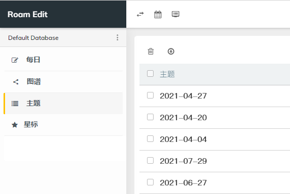

‍

所有的笔记都被放在文件箱里面，似乎也是在有意无意地传达着这样的观念：“自由记，别分类”、像是要打破传统的笔记系统结构，实现笔记系统结构的扁平化，让任何知识都可以是中心，“让笔记自下而上地生长，让所拥有的知识自动显示出结构”。

不管是这个“网状结构”的概念听着很新很”酷“，还是因为大家对“树状结构呈现信息关系不完全”苦恼了很久，现在终于看到一种解决办法所以感到兴奋，总之”网状结构“这个词确实火了好一阵子，就好像要和传统树状结构对立起来。打破传统树状结构，”迎接新力量开始新生活“，是当时的很多介绍双链笔记的推文都持有的态度 [21] 。

开始的时候我是完全不理解这种不分类的做法的，因为我相信结构化、逻辑化才符合我们的认知规律。而且一直以来都是用文件夹作为主力来管理我文件，突然间看到有观点说“不要分类，尽情记录”，马上就会下意识觉得这是不是在瞎说，因为信息不分类这感觉就很反人性——至少跟前面二十几年的习惯相当冲突，特别是对一个有整理癖的人来说，这简直不可理喻。

‍

> #### 【💡 举个例子】
>
> 网上很多使用印象笔记的小伙伴都有这样的感触，如果不注意笔记的整理，使用的时间越久，笔记数量越多，印象笔记就会越来越像一个“知识垃圾场”。特别是在印象笔记推出网页剪藏插件以后，有的用户就成了“近乎疯狂”的“剪藏家”：看到一篇好文章就剪藏下来，看完文章、做完标注、写完感想之后（甚至仅仅是看完），就把文章连同笔记一起放进软件中。本来还想以后什么时间可以复习一下，或者在需要用上的时候拿出来做参考，但是时间一长，每次打开看见那一大堆乱七八糟毫无规律可言的笔记，复习、查找的欲望顿时就少了好多。本来想让印象笔记成为“第二大脑”，最后却变成了“知识的垃圾场”，这实在是有点难受。
>
> 
>
> 因为我没有怎么用印象笔记，很久之前倒是用过一阵子微信的收藏功能，就贴两张截图上来让大家感受一下这“知识垃圾场”的气息……

‍

后来看到说还要建立索引，用索引来查找，就想到了这是在将文件夹分类变成了标签分类。虽然知道是有分类，但总觉得心里不踏实，毕竟这和之前的“操作习惯”不太一样，感觉理念也不一样，所以就算是用双向链贴上了标签还是用得很不爽，很不自然。

直到后来看到一位叫“临时哈桑”的大佬在语雀上发布的一篇评价 Notion 这个软件中的视图功能的文章 [22] ，以及对接下来笔记软件的视图功能发展趋势的猜测和探讨的文章 [23] ，我才理解过来：**不管是树状结构还是网状结构，其实都是笔记库展示在我们面前一种形式，也就是所谓笔记库的“视图”。我们关注的重点不同，笔记库呈现在我们面前的样子就会不同。** 最先实现这种功能的软件应该是在笔记圈几乎“被封神”的 Notion。

‍

> #### 【📌 补充资料：Notion】
>
> 
>
> 这是一个国外的、免费使用的、 **“将笔记、知识库和任务管理无缝整合的协作平台”** ，它提出了很多关于信息管理的新理念和新功能，除了上面提到的视图，还有最著名的，也是最具有颠覆性的概念：”Block“，这是 Notion 中最基础的，也是最重要的组成单元，国内也有一些用户将这个直接翻译为“块”。
>
> 在传统的笔记软件中，一篇文档，或者说一篇笔记就是笔记库的最小的组成部分，不能再细分了。但是对于 Notion 而言，Block 才是最重要也是最基础的。无论是一段文字、一个附件（图片、视频、音频、pdf……）还是一个网页、一个公式都是一个 Block。这些各种各样的 Block 随意搭配组合变成了 Page，不同的 Page 和 Block 又可以互相嵌套，成为对方的其中一部分。这种“万物皆 Block”的拥有极大自由度的笔记组织理念，是让 Notion 成为了笔记圈中“被封神”的原因之一。
>
> 另一个原因是 Notion 的核心功能：database（直译就是“数据库”，不过暂时比较少人使用这个称呼，一般都不翻译直接使用），这个 database 的理念基础就是“一元化”和“格式规范化”——所有进入同一个 database 的笔记都拥有相同的属性维度（可以认为是前面说的标签类型，如时间标签，内容标签等），拥有相同的地位。
>
> 视图功能的实现正是得益于 database 的超高自由度。Notion 中的视图一共有六种，下面的展示图按顺序分别是：表格视图、看板视图、日历视图、画册视图、列表视图以及时间轴视图。
>
> **Notion的几种视图:**
>
> 
>
> 
>
> 
>
> 
>
> 
>
> 
>
> Notion 可以根据用户设定的查看重点，生成适合的视图。例如，用户希望查看不同时间内做的笔记数量，这是侧重查看笔记的时间属性，那么就可以使用日历视图或时间轴视图。又例如用户想查看包含某个特定标签的笔记，这是侧重自定义的属性，就可以使用普通的表格视图或者看板视图。
>
> 而且因为 database 支持使用编程语言（具体是哪一种不清楚，没有深入使用过），所以和普通的表格相比，应该能实现更加复杂的功能，例如就有人用它自定义了一个自动化的进度条[24]。
>
> 虽然 Notion 的功能强大是公认的，但因为他的服务器在国外，而且这是纯云端的软件——就是说所有的数据都是存储在国外的服务器里，加上国情原因，打开速度一直堪忧，甚至曾经一度打不开这个软件。最近一段时间似乎好了很多，可以正常使用了，但谁也不敢保证将来也一直可以正常使用，除非有梯子（听说 Notion 的中文版已经在测试阶段，快要上线了，不知道最后会不会像 Evernote 那样出一个印象笔记这样的本土化的软件），国内的一些用户因此逐渐将目光转向别的软件。而国内一些包括但不限于笔记领域的软件也借鉴了 Notion 的功能，例如由国人开发的，在笔记领域被称为本土化 Notion 的 我来 wolai，，以及作为协作和管理平台的飞书中的的飞书文档。

‍

Notion 的各种视图都是基于 database 转换而来的，而 database 是"笔记一元化"和“格式规范化”的体现，所有的笔记都处于同等的地位，我们需要以什么属性主，就生成适合那种属性的视图方便我们查询使用。我认为这才是笔记库正确的打开方式。

不过，因为所有的笔记都处在相同的地位，这个和树状结构要求的笔记之间要形成父子级关系是矛盾的。也就是说，我们似乎选了 database，就没有办法构建文件树。经过一段时间的摸索尝试，我最终借助思源笔记找到了一个比较好的解决方案。因为思源笔记不仅提供了双向链功能，还支持使用一部分 SQL 语言对笔记库进行检索（ SQL 语言就是专门对数据库，也就是 database 进行处理——增删查改的语言）。

无论是树状结构还是 database 的网状结构，都只是一种视图。对于上面搭建的笔记体系来说，这种网状结构的核心是标签。所以，我们完全可以使用符合我们认知和使用习惯的树状文件夹结构对笔记进行管理，然后利用双向链的汇总功能和 SQL 的查找筛选功能将相关笔记找出来，最后像 Notion 那样用合适的视图将结果呈现在我们面前（这个视图功能需要借助思源正在开发的挂件块功能实现，已经有大佬写了一个挂件块样品实现了刚才说的 Notion 的前五个视图（还没有实现时间轴视图），具体什么是挂件块以及关于这个挂件块样品的更多信息可以到相应的 Github 仓库了解） [25][26] 。

我现在就是将相关度比较高的、有相同话题的笔记都放在一个文件夹中，例如我某本书的读书笔记放在一块，一些专题思考也放到了一块，其他暂时没看见有明显联系的笔记就全都放一块。表面上看是和普通的笔记体系一样分成了很多文件夹，但实际上我可以随时按照我的需要对笔记进行汇总。

‍

> #### 【💡 举个例子】
>
> 例如，我可以在电脑端的反向链接面板看到哪一天整理了哪些笔记进我的笔记库，但在手机端没有这个显示反链的功能，如果我要在手机上看反链的话，假如是《西游记》的读书笔记，我可以利用 sql 将标签里含有“《西游记》”和“读书笔记”的笔记汇总到一个页面，这样我就可以获得一个可以自动更新的西游记笔记目录（这也是下文说的 MOC），完全不用动笔记库的结构。
>
> 
>
> 这种查询就很像是对数据库进行操作（事实上思源笔记确实是将所有笔记都链接到一个数据库文件中，并且不是以一篇笔记为单位，而是像 Notion 那样以块为单位）。如果熟悉数据库相关知识的小伙伴，完全可以找到思源笔记的数据库文件，用相关软件打开这个数据库直接进行操作，这个和在思源笔记里操作是完全一样的，只是最后结果呈现的形式不同（数据库中是以列表的形式呈现结果，思源笔记中是以“块”呈现结果）。
>
> 
>
> 上面两张图展示的是对思源笔记的 database 文件直接进行搜索操作前后的对比。图里的每一行就是思源笔记中的一个“块”，每一列就是块的属性。
>
> ‍

‍

 **“规划从来都是自上而下、积累一定都是自下而上”。**  在有明确主题的情况下，使用树状结构聚合管理笔记是明智的选择，方便我们快速查找使用，这个有点像是笔记“收藏夹”。当这个主题的有效期过了之后，我们大可以将他们放回原来的地方，让他们回归“自由的状态”。

要构建笔记之间的父子级关系，除了新建文件夹，还可以采用另一种方案——MOC。MOC 使用单向链接就可以做到，在有了双向链的特性之后，用 MOC 方法组织笔记，在效果上比树状结构会更加有好。因为 MOC 本身就是单向链接的一种使用方法，它在引入双向链时可以说是无缝衔接，可以让整个笔记库（信息库）的结构显示得更加完整。而不是像“文件夹分类”这种方法，因为和双向链的管理理念不同（MOC 管理指向对象的链接，文件夹管理实际对象），因此很难兼容在一起进而发挥更好的管理作用。

‍

> #### 【📌 补充资料：MOC】
>
> 全称为“Map of Content”。顾名思义，既然是叫内容地图，也就是说我们可以通过“这张地图”提供的线索找到我们想找的内容，因此 MOC 可以理解为一种对索引内容进行有目的性地整合管理的结果，那种导航网站就可以看做是将各种各样的网站整合到了一起形成 MOC。书籍目录也可以看做是一种 MOC[27][28][29]。
>
> 对于笔记库来说，如果标签也能分类聚合，某种意义上这种做法也可以认为是一种粗略的 MOC，因为一般情况下一个标签都会指向很多篇笔记，而不像 MOC 最终可以指向某一条具体的笔记。

‍

### 4.2 双向链关系图的作用

#### 4.2.1 双向链关系图的形成

既然 MOC 是指向某种内容的链接、索引的集合，那我们应该是可以通过某种方式，将这种索引之间的关系“可视化”，一览整个笔记库（信息库）的结构，从而可以对当前状态有更全面的了解。

但在传统的笔记管理中，不知道是因为这种标签关系网络图在技术上不好实现，还是大家认为这种关系图不好用，总之几乎没有笔记工具实现这种功能。直到 RR 这款双链笔记的出现，才顺带将这种关系图（在双链笔记中一般叫做“双向链关系图”，简称“关系图”或“关系图谱”）呈现在大家面前。

‍

> #### 【💡 举个例子】
>
>    
>
> 一些介绍卡片盒笔记法的推文也会贴上类似这样的双向链关系图，第一张是 RR 官方帮助文档的关系图，第二张是一个 Obsidian 用户的关系图 [30] 。

‍

关系图刚出来那会确实是给用户一种相当惊艳的感觉（至少当时我确实是被 Obsidian 的这种绚丽新颖的关系图吸引到了，笔记群的小伙伴在双链笔记刚出来那会也经常讨论这个关系图），用一些文章的话来说就是“没想到笔记还能做成这样” [21] 。

虽然这种纵览知识库的感觉真的很奇妙。而且像 Obsidian 的关系图，拽一拽还能 Q 弹 Q 弹地动，相当解压。但是当新鲜感褪去，开始考虑起这些关系图在实际使用中有什么作用时，就发现这东西好像没什么用。笔记群里的每隔一段时间也会有新加入的小伙伴提出这样的疑问，而大家的意见也是出奇的统一：这个关系图在双链笔记里确实没有什么用——除了拽着玩解压。

至于说要做到很多推广笔记软件的文章里提到的纵览知识库这样听上去“挺高级”的状态，其实是挺不容易的，特别是在现在所谓的“碎片化学习”的时代。你以为，每天都记录整理一些笔记和信息，过一段时间自己的关系图也可以变成上面所展示的那种连接的样子，但实际上关系图很可能是下面这个样子的：

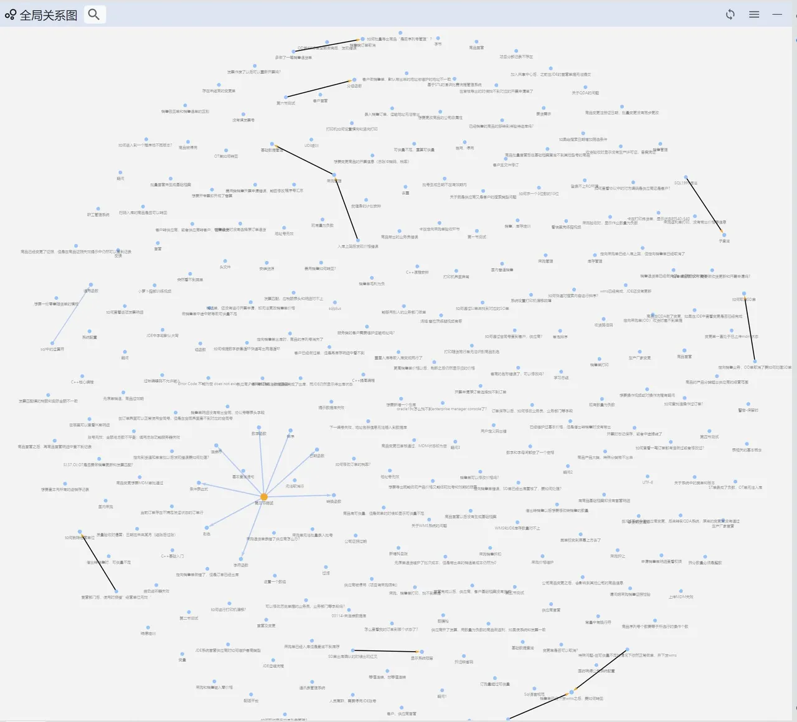

图片来自思源笔记群里小伙伴的分享，这应该是没有建立索引系统的笔记库的关系图（相当于隐藏掉索引标签后的样子），大部分笔记都“孤零零”游荡在图谱之中，只有少量的笔记会形成链接的关系。这是因为如果没有明确的记录目的，那我们所记录的笔记和信息的将会十分地零碎，想要将这些笔记之间中间“缺失的”其他笔记和信息给补上，形成推文里展示的链接状态，是需要比较长的时间的。换句话说，上面那种“好看的”、“别人家的”关系谱，其实是有明确的主题的。就拿那张 Obsidian 的图片来说，那是一位博士研究生的笔记库的关系图，而一般博士的研究方向是很明确的，也比较细 [31] 。笔记、知识之间的关联度自然会比较高，因此可以呈现出推文所宣传的那种效果。

说到这里，有些朋友应该会觉得这个关系图和另一个东西有点像，那就是知网的文献互引网络 [21] 。

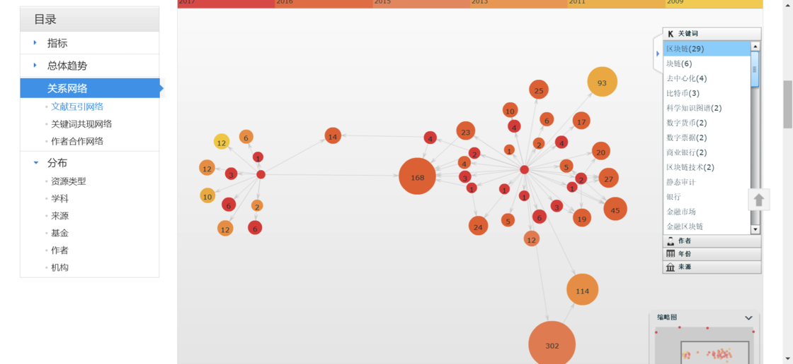

在文献互引网络中，和某个主题相关的文献会被链接到一起，用户可以通过这个“可视化”之后的链接关系快速定位自己想要的内容，以及大概了解这个内容在整个相关知识的体系中的位置。也就是说，关系图的主要作用不是看自己缺哪一块知识，而是快速检索。如果只是使用零碎信息生成的关系图，确实是没什么实际作用的，但当我们某个主题的笔记很多，用导航（索引页）寻找的效率很低的时候——例如在某个领域的文献，就可以考虑用关系图去检索想要的笔记。

‍

> #### 【💡 举个例子】
>
> 因为工作需要，我经常收集整理一些市场上的视频脚本和文案，使用双向链和我搭建的关键词系统（标签体系）可以帮我建立起这些视频内容之间的关联。
>
> 如果要想看到内容发展的整体趋势，只靠双向链提供的每个关键词的反链数量是很麻烦的——不说要一个一个点开看这种麻烦的操作，就算像思源笔记这样可以直接看到被引用的数量，在一堆数字中找到最大的数字效率也是比较低的。
>
> 但如果是直接看关系图就不同了，虽然只是一堆点，但是按照思源笔记设定的显示逻辑，被引用的次数越多，点就越大，这样一样，我只需要瞥一眼，就能看到最大的那几个点，然后放大去看就可以了，很容易就定位到被引用次数最多的关键词，也可以说是现在和市场上内容的整体趋势。
>
>    
>
> 双链关系在树状结构和网状结构中呈现不同的状态会对工作效率产生影响，可以明显看到，右边的网状关系里有两个相对较大的点，那是目前被引用次数最多的两个关键词。
>
> 但如果是直接看关系图就不同了，虽然只是一堆点，但是按照思源笔记设定的显示逻辑，被引用的次数越多，点就越大，这样一样，我只需要瞥一眼，就能看到最大的那几个点，然后放大去看就可以了，很容易就定位到被引用次数最多的关键词，也可以说是现在和市场上内容的整体趋势

‍

‍

那是不是说，除了在这种复杂情况下用于检索，这关系图就没什么用了呢？暂时来看是的。除非这个关系图可以往别的方向发展 [32] 。例如 Trilium 的 Relation Note，可以在节点之间增加一些信息，这个用来梳理一些小说之类的人物关系感觉还是很好用的。

而我们要想得到“别人家”的那种关系图的话，要做的其实就是做专题笔记。例如写一本书的读书笔记、某个领域的学习笔记、对某个问题进行思考而记录的专题思考（阅读）笔记等等。只要有这种主题明确，或者说目的性很明确的相关笔记出现，那这种网络形状自然很快就会形成。

#### 4.2.2 双向链关系图与碎片化学习

如果是平常那样随手刷到一篇推送文章，一个视频，觉得挺有道理然后记录下来，这种状态下记录的笔记自然难形成链接。因为我们缺少一个“知识骨架”来支撑、连接起这些碎片化的信息，这也是在进行“碎片化学习”时比较容易忽略掉的问题。

在这个节奏越来越快的时代，似乎大家无论干什么都要快，追剧，看综艺，看电影甚至看教程，都想选择 2 倍速甚至 4 倍速

> #### 【💡 举个例子】
>
> 关于追剧开倍速，有些人认为这是因为现在一些网剧的质量普遍偏低，明明 1 集就能讲完的事情，非要灌水拖到 3 集甚至更久，因为受不了这种做法，有些人就只能选择开倍速来快速跳过这些灌水的剧情。
>
> 我比较少追网剧和关注这部分的内容，不太清楚实际情况是怎样的，仅仅把这个观点贴出来以供参考

‍

但是学习掌握新知识、新技能这事，好像快不了，就像是老师讲课，无论再怎么赶，该讲内容也还是没办法快速跳过的。既然没有办法挤出一整段时间来进行这种“系统化”的学习，那就将这些知识点全部拆开，利用各种闲暇的 5-10 分钟时间进行学习 [33] ，大概这就是“碎片化学习”的起源。

在这个信息爆炸的互联网时代，要进入“碎片化学习”的状态还是很简单的。不评价这种学习方式的效果如何，但如果缺少很明确的学习主题，而盲目开始自己认为的所谓“碎片化学习”，将会产生不好的影响。因为我们认为这是在学习（其实只是在接收“碎片化的信息”），所以更加容易忘记进行判断信息的真假，然后直接全部记录吸收。如果信息（提出的观点）是合理的倒也没什么，要是接收到一些虚假的、不合理的信息并且还当做是自己学到的东西而坚信不疑，这才是最可怕的。

‍

> #### 【💡 举个例子：高晓松效应】
>
> 一个典型的例子是很多人都在网上说的高晓松在《晓说》等节目里“满嘴跑火车” [34] 。
>
> 我没有看过他的节目，但是从知乎网友们分享的“刚编出来的”各种例子可以看到一个相似的特征：高晓松在讲其他自己不熟悉的领域的知识的时候，自己会觉得”原来是这样“，大有开拓眼界的感觉；而当他讲到自己有所涉猎甚至是熟悉的领域的知识的时候，自己又会觉得漏洞百出，大有误人子弟的趋势。有一个回答下的评论对这个问题下的回答特点总结得挺到位：“高晓松知识广博挺厉害的，如果他不聊到我知道的领域的话” [35] 。我愿称这种现象为"高晓松效应"
>
> 虽然高晓松也曾“承认自己的知识里很多错漏，没有查阅典籍，纯属闲聊吹牛” [36] 。可就上面大家统一的体验来说，这是“说者无意，听者有心”，特别是在这种节目里他所表现出的自信的状态，很容易会让一些人对其中不合理观点信以为真，造成不好的影响。对信息盲目信任导致的最严重的后果可以参考“莆田事件”。

‍

在现在社会这种快节奏状态下要碎片化学习无可厚非，能多学一点东西也是挺好的，无论是增长见识或者是多样技能，毕竟“技多不压身”。但是碎片化学习应该是要在对知识有系统性的了解（或者对信息有比较全面的认知把握）的状态下，对自己现有认知边界的逐步扩展，而不是把它作为学习的主要方式。

现在获取信息实在是太简单了，加上“短视频”的爆发，我们面对质量良莠不齐的信息的机会比以前要多太多，当某个领域相关的信息像“洪水一样“涌过来的时候，我们想要分辨出那些不合理、不准确的观点和信息，前提是要对领域内那些基本问题，有自己的认知和理解，而这是需要以对这个领域的整体认知作为基础的。

‍

> #### 【💡 举个例子：推翻狭义相对论】
>
> 前阵子河北省今年的科学技术奖中出现了一篇声称“推翻相对论”的论文，掀起了不小的风波。我看到这个标题的第一反应就是“又有民科搞事情了”——即使论文的作者是正儿八经的教授，但是有教授碰瓷物理学经典理论也不是第一次发生的事了。不过这里不是说这个“民科级别”的研究以及它在这个事件里带来的政治影响。而是想说最近我刚好遇到的“高晓松效应”。
>
> 在抖音里有个名为“试图问倒自称懂哲学的老爸”的账号，主要是通过“女儿”的提问让“老爸”分享“对某些问题的看法”，从文学历史到政治哲学都有涉猎，问的问题基本也是在这些领域范围内。每次看他们的视频观感都不错也挺喜欢的——毕竟小姐姐也很好看（大雾），直到最近他们的第 137 问，蹭了这个“推翻相对论”的热点，才惊觉自己是不是遇到了“高晓松效应”。
>
> 印象中这好像是他们第一次涉及自然科学类的问题（也可能是想从哲学的角度探讨），但作为一个物理专业毕业的学生，我对这一期的内容确实是看不下去（可能是“碰瓷经典理论的基本都是民科”这种先入为主的观念影响有点大）。明面上听着，跟着他们的逻辑走好像确实是可以“推翻狭义相对论”，但是稍微深究一下就会发现他们的论证是有问题的。另外，“老爸”在视频中提到自己的这个观点在 2011 年就在博客上一篇名为 **《以“光速不变原理”为依据，与速度越快时间越慢之间存在逻辑矛盾》** 的文章里写过[37]，本着求真的目的上网搜索了一下，还真的找到了，有兴趣的朋友可以去翻一下，看看问题出在哪。
>
> 虽然不知道他们这个团队是想蹭“推翻相对论”这个热点，还是想借这个话题搞一手“反向操作”引发评论数量爆炸吸引流量以提高作品热度（翻下评论，表示质疑的人数不少），还是想走“高晓松”的老路子“单纯发表一下自己的观点”，但无论如何，“第 137 问”这期视频的内容确实会误导一些观众，给他们传递一些不合理的信息（评论中表示赞同，受教的人虽然不多，但确实有）。经过这次亲身经历之后，更加觉得自己要对不了解的东西要保持谨慎的态度，同时还要多进行些系统的学习训练才行。

‍

### 4.3 工具和方法的联系

RR 刚出来的时候，虽然大家都吹得很厉害，但我确实是无感。我更喜欢用传统的页面写东西。大纲类的软件，例如幕布，我更加习惯用它来整理我的思路。合适的才是最好的。

少数派的一篇文章里提到这样一个观点： **“选择了一种工具，就是选择了一种方法”**  [38] 。这个观点还是有点意思的。软件本质上都是一种工具，都是想要用某种理念去解决某个问题的，这也是为什么会有“产品设计理念”这个概念。例如 Obsidian 和思源笔记，虽然都是文档型双链笔记，但是在解决双向链接这个问题上，两个软件的理念是完全不同的。Obsidian 是用一种类似于脚注的超链接形式，将文档链接起来，至少在用户界面看到的链接还是以文档为单位的。而思源笔记则是像 Notion 那样，直接将文档中每一个元素都看作一个“内容块”，每个内容块都有自己独一无二的编号，靠这种编号实现任意级别内容的链接，这种解决方案在我看来自由度是很高的，后来思源笔记作为文档型双链笔记第一个成功实现了“文档包围大纲”的功能（用户可以在文档内直接实现大纲型双链笔记的功能而不需要借助插件），和需要使用插件才能勉强做到这种功能的 Obsidian 相比，思源笔记的这种设计理念上的优势是很明显的。或许一开始接触笔记软件的时候就是被这种“超有想象力和创新性的”想法给吸引了（当时还是一个刚入圈，不知道 Notion 的萌新），然后就果断付费入坑了。

虽然市面上很多笔记都有双向链的功能，但并不一定都适合用来来实现自己对于笔记体系的构想。我也是后来随着深入使用思源笔记，以及尝试使用别的软件之后，才逐渐觉得思源笔记的这种设计理念真的很适合拿来实现我构想中的笔记体系。例如，幕布虽然也支持任意级别内容的双向链接，但是在双向链关系图里显示的只是文档级别的链接，也就是说，如果我使用上面说的方法在幕布里建立 MOC，在双向链关系图里呈现出来的将会是所有关系都链接到一个文档里；而在思源笔记里因为是以“内容块”为基本单位，所以我就可以在需要的时候选择呈现从文档到内容块之间任意级别的双链关系——即使我基本都是用 MOC 来跳转很少用关系图跳转，不过至少软件本身是有能力比其他竞品多提供一种选择，这也可以算是和其他同类产品做出的一个小小差异化吧。

# 后记

这篇推送一开始的构想其实只是想分享一下记笔记的流程，顺便安利一下思源笔记这个软件，完全没有想到最后会变成这么多的内容。要做好笔记管理本身就有很多要考虑的问题，甚至随着考虑的问题越来越多，最后还变成了从到信息管理的角度去看待这个问题，这着实是初期定题的时候没有想到的。算是意外收获的其中一个小惊喜吧。

另外在这个过程中，也在笔记群里认识了很多大佬，他们对“记笔记”这件事都有自己独特的理解，也很热情地一起分享交流自己的笔记流程、各种软件（包括但不限于笔记软件）的使用心得，以及探讨这些软件背后的设计理念。

而且非常幸运，思源笔记的开发者 D 大和 V 姐有空也会跟大家一起“水群”，讨论思源笔记的发展，群里曾经一度半开玩笑地说这个群的状态：开发思源笔记的团队总共 1700 多人，包括 2 个开发，20 来个测试和 1600 多个产品经理。虽然我上思源的车晚了一点，但确实是看着群里的人数从一开始的 700 多人到现在的 1700 多人，也看着 D 大和 V 姐他们怎么样和“产品经理们”唇枪舌战，让思源笔记一步步发展成现在的样子。

这段经历真的很难得，虽然不是从无到有（从立项到产品落地）地看着一款产品的诞生，但是因为上车那段时间刚好也是处在双链笔记“百花齐放”的状态，双链笔记市场竞争十分激烈，所以刚好有机会看到大家对其他竞品的发展路线及思源笔记这款产品的后续发展模式的讨论（群里的小伙伴其实不单单只在用思源笔记，有不少人其实在用好几个笔记软件来打造自己的工作流，并且加入了其他笔记群和其他深度使用的用户交流，算是知己知彼吧）。

小伙伴的讨论以及我自己在这场“双链笔记软件大战”中的体验，意外地让我对那个经常在知乎上看到的“老板和程序员的对线”问题有了新的理解。这算是另一个小惊喜了。

‍

> #### 【💡 举个例子：程序员和老板之争】
>
> 程序员总希望花一点时间将产品打磨的更好，因为优化过后产品的性能可以提升 100-100 万倍，用户可以有更好的体验，然后大家口口相传，真正做到靠实力吸引更多的用户，但老板却总希望产品尽早上线，即使现在的产品并没有想象中那么好用。因为早上线和晚上线，用户数量可能就会差好几个数量级。没有抢到用户的产品，可能就没有机会在市场里活下来
>
> 时间总是只有那么多，怎么样平衡产品的性能以及市场的抢占速度，这一直是一个被讨论的问题。

‍

因为软件实在太多了，而且时间有限，加上体验的那几个软件确实没有特别打动我的地方，所以最后还是只留下了最初的思源笔记和幕布。如果对软件也有一见钟情，那思源笔记一定可以算一个。不知道为什么，第一次体验的时候就觉得它就是我想象中的双链笔记的样子，即使那时候还是很早期的状态，和 Obsidian 这样相对已经比较成熟的工具几乎没有什么可比性，但还是付费了。上一个让我体验过一次就马上付费的是幕布。目前来看，我觉得这两次付费还是很值得的。除了找到心仪、趁手的工具，还打开了新世界的大门。这样的机会简直就是可遇不可求啊不是吗？

最后，作为思源笔记的自来水，我在这插播一条思源笔记的广告，开发者 D 大和 V 姐是没有财务压力的（他们自己说的） [39] ，开发这款软件纯粹是用爱发电，所以本地所有功能都是免费的！现在优化之后的版本，就算笔记有 60W 字，使用起来也是相当丝滑没有任何卡顿感，加上和 Notion 一样的“万物皆块”的信息组织理念，完全可以把它当做本地的 Notion 来用了。

也欢迎到“思源笔记的自来水厂” [40] 了解更多信息\~

‍

# **参考资料**

1. @Zack，革命性思维工具：Roam Research 白皮书，知乎文章
2. @ 临时哈桑，为什么 2020 年双链式笔记如此热门？这类工具适合做什么样的笔记？知乎问答
3. @Plidezus  Leo，卡片盒（Zettelkasten）笔记法，产品沉思录（精选）
4. Sönke Ahrens，《How to Take Smart Notes， 1.3 The slip-box manual
5. @ 王树义老师，详解 Roam Research 系列之三： Roam 不是卡片盒，bilibili 视频
6. @ 机智的阿饭，flomo weekly vol.029 - 不写，就无法思考，微信文章
7. @ 未来现相，费曼学习法总结，知乎文章
8. 奥野宣之，如何有效整理信息，第 1 章 一册笔记本建构的知识生产体系
9. 奥野宣之，如何有效整理信息，第 3 章 高效率记录信息的书写和粘贴法
10. @Denie，Roam Research 不是这样用的，知乎文章
11. @ 可可爱爱木的脑袋，踩死的蟑螂不收拾为什么第二天没了？知乎问答
12. 陈洪澜，论知识分类的十大方式，科学学研究，2007 年 2 月，第 25 卷第 1 期
13. @Ryooo，(1 封私信) 如何构建自己的笔记系统？，知乎文章
14. @ 落山鸡，[Obs#11] 數位筆記方法—PARA 與 MOC 介紹（以 obsidian 来实现），哔哩哔哩
15. @ 少楠 Plidezus，P.A.R.A. 是什么及在 Notion 中的应用，少数派文章
16. 奥野宣之，如何有效整理信息，第 6 章 方便自由参考的笔记索引化，对索引数据去芜存菁
17. @ 雪映，如何评价「我来 wolai.com」这个产品？，知乎问答，标准化行为，反而激发创造力
18. LOD 技术，百度百科
19. @ 思成-BIM 工程师，LOD 概念（一），知乎文章
20. @ 雪映，如何评价「我来 wolai.com」这个产品？知乎问答，第一部分 wolai 可以做什么 & 为什么要这么做
21. @yuchen\_lea，请不要神化双链笔记，少数派文章
22. @ 临时哈桑，功能：Notion 的 database 是一个应该被淘汰的过渡品，语雀文章
23. @ 临时哈桑，中期预言：widget block 与「视图」，语雀文章
24. @ 潇潇学姐\_，用 Notion 搭建个人图书馆 ｜database 的灵活玩法 ｜ 一次建立终身受用的知识体系库，哔哩哔哩视频
25. 挂件块 · Issue #1488 · siyuan-note/siyuan ，GitHub
26. @langzhou，Note Views，Github
27. @AllinBon，再谈与 Obsidian 共舞的知识管理，知乎文章
28. Lion Kimbro，How to Make a Complete Map of Every Thought You Think
29. @ 临时哈桑，MOC - 管理链接而非本体，语雀文章，进阶：对 moc 的零碎心得
30. @Struggle\_with\_me，Tour | 如何用 Obsidian 图谱构建你的知识网络，bilibili 视频
31. @ 明德立人赵老师,读博士意味着什么？哈佛教授用几张图告诉你什么是 PhD ,知乎文章
32. @ 临时哈桑，MOC - 管理链接而非本体，语雀文章，虚假的图谱与真正的图谱
33. 周婧怡，何济玲，《“互联网 ”时代碎片化学习的特征、问题与优化策略》，中国医学教育技术，2021 年 6 月，第 35 卷第 3 期
34. @ 知乎千行，为什么现在对高晓松都是千篇一律的骂？，知乎问答
35. @ 知乎凯二七，为什么现在对高晓松都是千篇一律的骂？，知乎问答
36. @Ardorwooder  ，高晓松为何还没有倒？，知乎问答
37. 刘国明，以“光速不变原理”作为依据与“速度越快时间越慢”之间存在逻辑矛盾，新浪博客
38. @idelem，Trilium：超高自由度的个人知识库（高级篇），少数派文章
39. 思源笔记 v1.2.0 发布，一个全新的开始，链滴
40. 思源笔记自来水厂，语雀知识小组

‍

